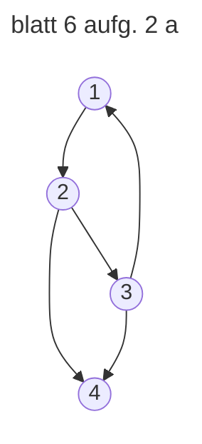
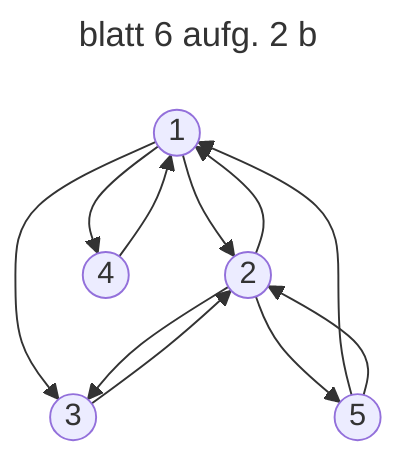
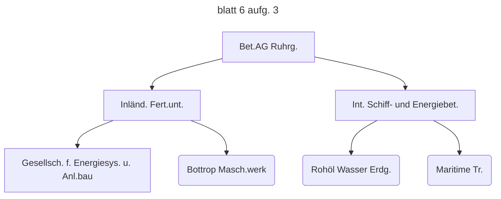

Mengendarstellung:

Knotenmenge (V):
V={Bet.AG Ruhrg., Inländ. Fert.unt., Int. Schiff- und Energiebet., Gesellsch. f. Energiesys. u. Anl.bau,
Bottrop Masch.werk, Rohöl Wasser Erd., Maritime Tr.}

Kantenmenge (E): E={ ( Bet.AG Ruhrg. , Inländ. Fert.unt. ) , ( Bet.AG Ruhrg. , Int. Schiff- und Energiebet. )
, ( Inländ. Fert.unt. , Gesellsch. f. Energiesys. u. Anl.bau ) , ( Inländ. Fert.unt. , Bottrop Masch.werk ) ,
( Int. Schiff- und Energiebet. , Rohöl Wasser Erd. ) , ( Int. Schiff- und Energiebet. , Maritime Tr. ) }

Grafische Darstellung Der Graph zeigt gerichtete Verbindungen

Eigenschaften des Graphen: Gerichteter Graph: Jede Beziehung zwischen den Unternehmen ist eine gerichtete
Beziehung, da sie von einem "übergeordneten" zu einem "untergeordneten" Unternehmen fließt.

Kein zyklischer Graph: Es gibt keine Schleifen oder Zyklen, d.h., ein Unternehmen zeigt nicht direkt oder
indirekt wieder auf sich selbst.

Hierarchischer Graph: Die Struktur stellt eine hierarchische Beziehung dar, die von einer Muttergesellschaft
(Bet.AG Ruhrg.) zu ihren Tochtergesellschaften abgeleitet wird.

Zusammenfassend handelt es sich bei diesem Graphen um einen gerichteten, azyklischen Graphen (DAG), der eine
klare Hierarchie abbildet.
