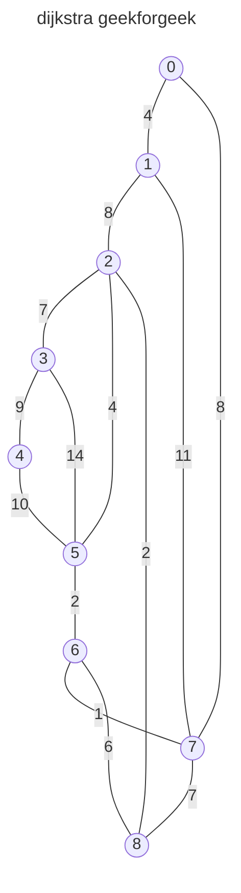

```mermaid
---
title: dijkstra geekforgeek
---

graph
    0(("0")) ---|4| 1(("1"))
    0---|8| 7(("7"))
    1 --- |8|2((2))
    1 --- |11|7((7))
    2 --- |7|3((3))
    2 --- |4|5((5))
    2 --- |2|8((8))
    3 --- |9|4(("4"))
    3 --- |14|5
    4 --- |10|5
    5 --- |2|6((6))
    6 --- |1|7
    6 --- |6|8
    7 --- |7|8
```
